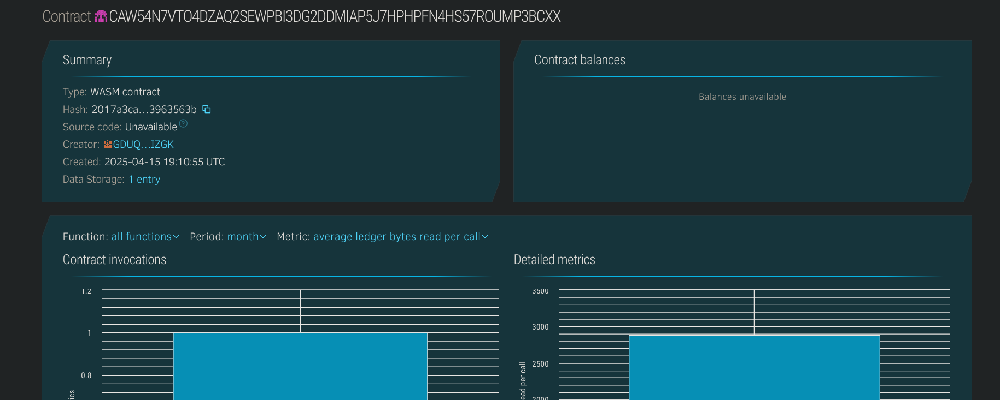

# Bug Bounty Tracker

## Project Description
The **Bug Bounty Tracker** is a decentralized smart contract application built on the Stellar Soroban platform. It allows developers or organizations to log bugs and track their resolution status in a transparent and verifiable way.

## Project Vision
To create a trustless system for managing and resolving bug reports on-chain, providing visibility and accountability to developers and bounty hunters alike.

## Key Features
- 🐛 **Bug Submission**: Add bugs with unique ID, title, and description.
- ✅ **Resolve Bugs**: Mark bugs as resolved on-chain.
- 🔍 **Bug Lookup**: Fetch details of a specific bug using its ID.
- 🔢 **Bug Count**: View the total number of bugs submitted.

## Future Scope
- 💰 Add bounty rewards with token payouts upon resolution.
- 🗳 Community voting to validate or prioritize bugs.
- 🧑‍💻 Contributor profiles and bug history tracking.
- 📊 Bug status analytics and dashboards.

## Contract Details
CAW54N7VTO4DZAQ2SEWPBI3DG2DDMIAP5J7HPHPFN4HS57ROUMP3BCXX
